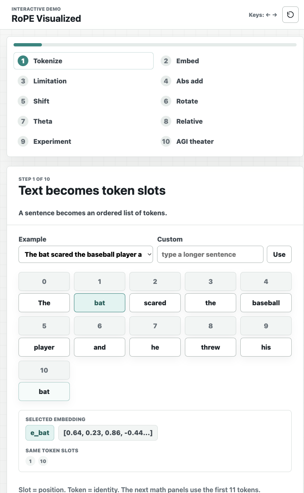
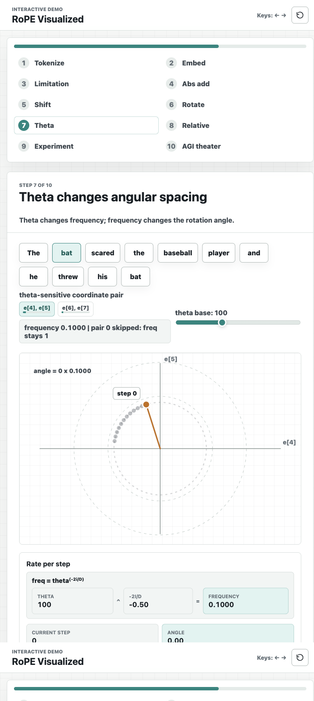
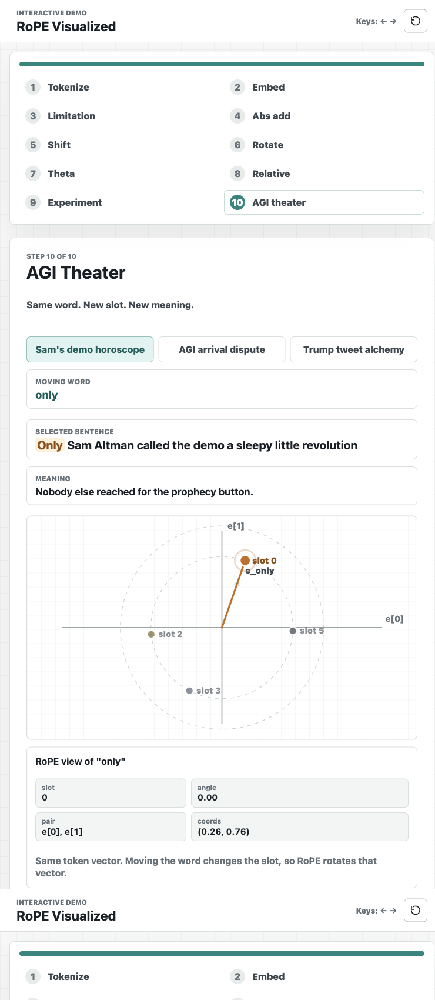

# RoPE Visualized

Interactive, dependency-free demo for teaching rotary positional embeddings.

## Open the Demo

Use the published static page:

[https://alenzimic.github.io/rotary-embeddings-demo/](https://alenzimic.github.io/rotary-embeddings-demo/)

Source repository:

[https://github.com/alenzimic/rotary-embeddings-demo](https://github.com/alenzimic/rotary-embeddings-demo)

## Preview

### Tokenize and ground the sentence



### Watch theta change the RoPE frequency



### Try position-sensitive examples



## What It Shows

This demo walks through embeddings as a concrete visual object:

- tokenization and deterministic demo embeddings
- why non-positional embeddings cannot distinguish repeated words by location
- absolute positional addition
- RoPE rotation by 2D coordinate pairs
- how theta changes frequency and angular spacing
- how positional choices change similarity patterns

The vectors are deterministic teaching vectors, not extracted model weights. The position addition, RoPE pair rotation, and cosine-similarity comparisons use the real formulas.

## Run Locally

Clone the repo:

```bash
git clone https://github.com/alenzimic/rotary-embeddings-demo.git
cd rotary-embeddings-demo
```

Option 1: open the static file directly on macOS:

```bash
open index.html
```

You can also double-click `index.html` from your file browser.

Option 2: serve it locally, which is closer to how students will use it online:

```bash
python3 -m http.server 8000
```

Then open:

[http://localhost:8000](http://localhost:8000)

No build step, package install, or backend is required.

## Deploy Your Own Copy

### GitHub Pages

1. Fork this repository or upload these files to a new GitHub repo.
2. Go to `Settings` -> `Pages`.
3. Under `Build and deployment`, choose `Deploy from a branch`.
4. Select branch `main` and folder `/ (root)`.
5. Save.

Your public URL will look like:

```text
https://YOUR-GITHUB-USERNAME.github.io/rotary-embeddings-demo/
```

### Static Hosts

This is a plain static site. You can also deploy the folder to Netlify, Vercel, Cloudflare Pages, an LMS file area, or any static web server. The required files are:

```text
index.html
styles.css
app.js
```

## Classroom Controls

- Use the left/right arrow keys to move through the story.
- Use the sliders and word buttons inside each step to change the visual examples.
- Step 9 lets students type their own sentence.
- Step 10 shows position-sensitive sentence examples.
